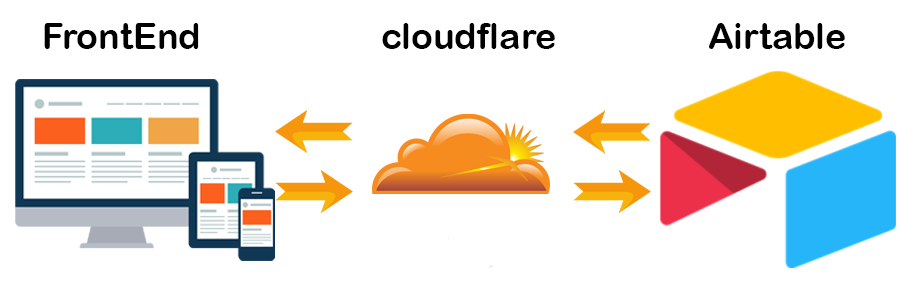
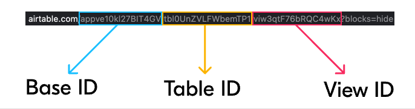
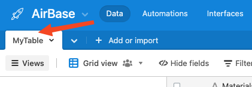

# Airtable Cloudflare Worker

A [Cloudflare Worker](http://developers.cloudflare.com/workers/) that allows you to make secure requests to the [Airtable API](https://airtable.com/api) from your web.

## Usage

### Prerequisites

- Cloudflare account with [Workers](https://www.cloudflare.com/products/cloudflare-workers/) enabled.
- An [Airtable Base ID](https://community.airtable.com/t/what-is-the-app-id-where-do-i-find-it/2984) and your [Airtable API key](https://support.airtable.com/hc/en-us/articles/219046777-How-do-I-get-my-API-key-).
- Node and Node Package Manager ([npm](https://www.npmjs.com/get-npm)).
- Familiarity with your computer's terminal/command line interface.

### Building Locally

The easiest way to see this project in action is to build your Worker locally and copy/paste it into Cloudflare's UI:

- Clone this repo: `git clone https://github.com/portable-cto/airtable-proxy-worker.git`
- Install dependencies: `npm install`
- Build the worker with your Airtable App/Base ID and API Key: `AIRTABLE_API_BASE_ID=appXXXXXXXXX AIRTABLE_API_KEY=keyXXXXXXXXXX npm run build`
- Upload the built `dist/worker.js` file to [cloudflareworkers.com](https://cloudflareworkers.com/) to test your script.

Your Airtable's tables will be available via the table name. For example, if my Airtable base has a table name `posts`, it would be available at `https://tutorial.cloudflareworkers.com/posts`.

In order to deploy the worker to your own personal worker, upload it via the web UI and click "Deploy".

### Configuration

- `AIRTABLE_BASE_ID` - Enter your table ID here.

- `AIRTABLE_API_KEY` - Enter your API Key here.
- `TABLE_NAME` - Enter your Table Name here .

## Contributing

Contributions are welcome and encouraged! When contributing to this repository, please first discuss the change you wish to make via the [issues on Github](https://github.com/EduardKop/Airtable-Cloudflare-Worker-Proxy/issues).

## License
 
The MIT License (MIT)

Copyright (c) 2018 Portable CTO, LLC

Permission is hereby granted, free of charge, to any person obtaining a copy of this software and associated documentation files (the "Software"), to deal in the Software without restriction, including without limitation the rights to use, copy, modify, merge, publish, distribute, sublicense, and/or sell copies of the Software, and to permit persons to whom the Software is furnished to do so, subject to the following conditions:

The above copyright notice and this permission notice shall be included in all copies or substantial portions of the Software.

THE SOFTWARE IS PROVIDED "AS IS", WITHOUT WARRANTY OF ANY KIND, EXPRESS OR IMPLIED, INCLUDING BUT NOT LIMITED TO THE WARRANTIES OF MERCHANTABILITY, FITNESS FOR A PARTICULAR PURPOSE AND NONINFRINGEMENT. IN NO EVENT SHALL THE AUTHORS OR COPYRIGHT HOLDERS BE LIABLE FOR ANY CLAIM, DAMAGES OR OTHER LIABILITY, WHETHER IN AN ACTION OF CONTRACT, TORT OR OTHERWISE, ARISING FROM, OUT OF OR IN CONNECTION WITH THE SOFTWARE OR THE USE OR OTHER DEALINGS IN THE SOFTWARE.
